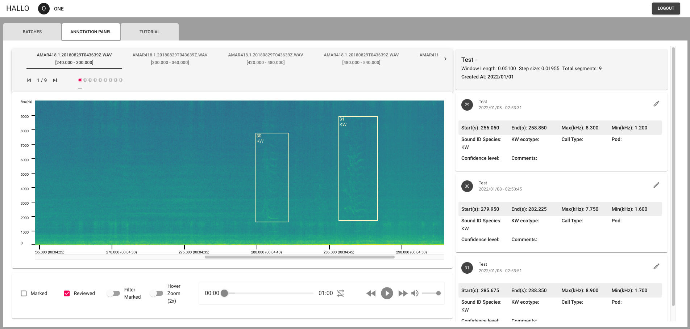
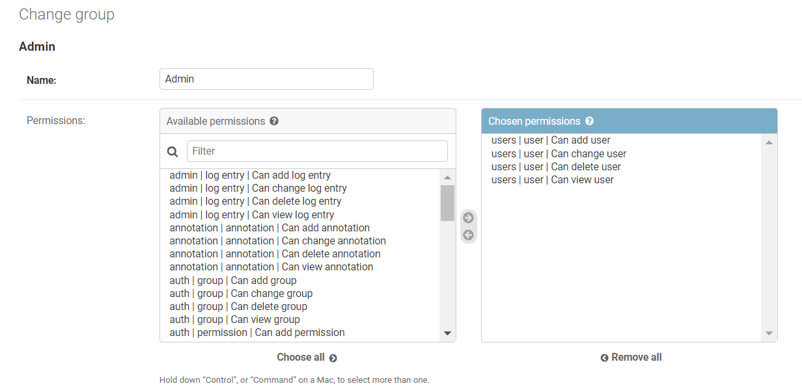
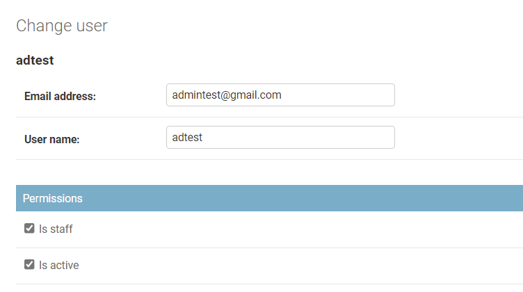
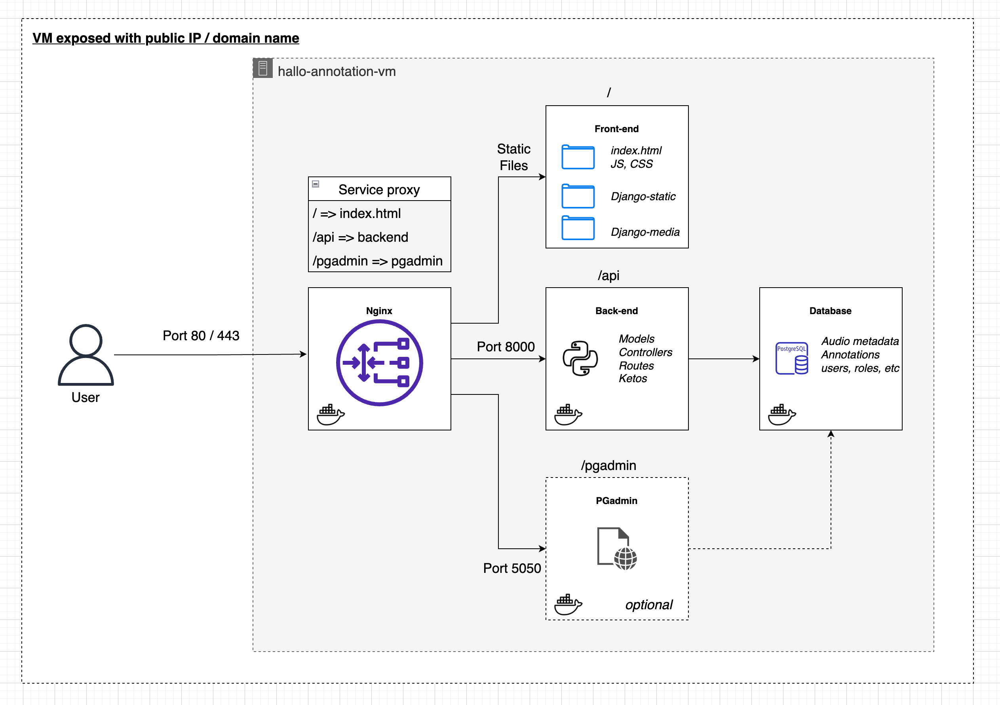
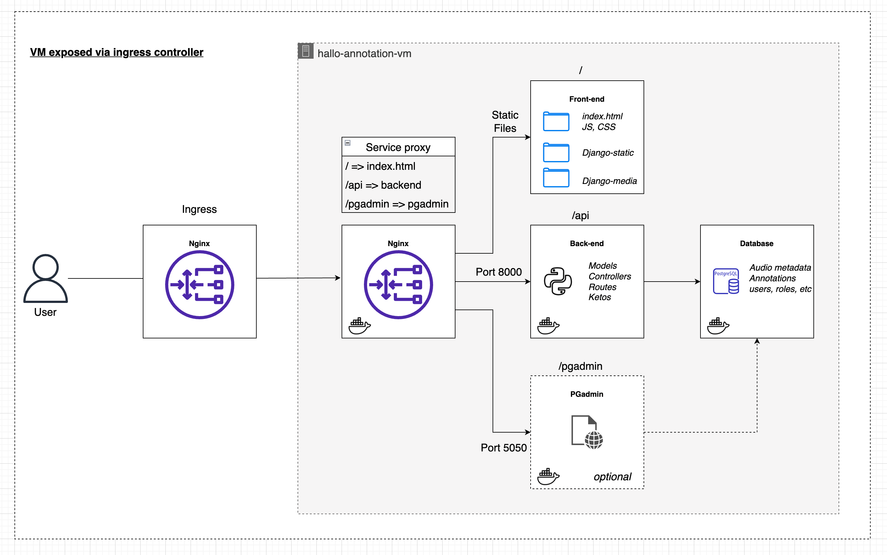

# Hallo annotation tool

[Introduction](#introduction)

[Software Architecture](#software-architecture)

[Local/Dev Instance Setup](#local-instance-installation-guide)

[Deployment in the Cloud](#deployment-in-the-cloud)

[Deleting Local Instance](#deleting-the-local-instance)

---

## Introduction

Hallo annotation tool is a web application for analyzing and annotating audio files, consisting of three main modules: front-end(user interface), back-end(data processing) and database. It is licensed under the [GNU GPLv3 licens](https://www.gnu.org/licenses/) and hence freely available for anyone to use and modify.

The main functions are:

1. Managing raw audio files, segmenting and compressing them in the back-end and generating the corresponding spectrograms.

2. Users can register as two roles, Model developer and Annotator. Model developer can create a Batch containing audio segments for assigning to one or more Annotators, or import annotations created by machine and assign them to annotators. Annotator can wrok on the spectrogram of the audio segments, review the corresponding annotations, or play back the audio.

3. The generated data can be exported to csv format.

---

## Software Architecture

Hallo application tools use a modular design, with two separate applications for the front-end and back-end, communicating data through the Restful API protocol.

The backend is implemented using the Django framework, and [Ketos](https://docs.meridian.cs.dal.ca/ketos/) is installed as the core component for processing audio, providing a set of standard APIs for the frontend to consume.

The front-end is built using the React framework and runs in most modern browsers. A clean and easy-to-use design is used, focusing on synchronizing, filtering and quickly finding data.



---

## Installation

HALLO annotation tool is composed of two parts: front-end and back-end. The back-end needs to be installed on a server that can read data directly, and the front-end can be installed on any server.

Two methods of installation are described below, one is installed locally as a local development or usage, and the other is installed on a remote server for multiple users to access and use. Both ways use docker as a carrier to install.

Users can also adapt the code to their needs and deploy it according to their own installation environment.

## Local instance installation guide

---

### Prerequisite

In the example of a local installation, the HALLO annotation tool runs in a few Docker containers and requires Docker and Docker-compose to be pre-installed on the system.

### Steps

1. The HALLO annotation tool needs to be installed in the same directory as the audio files, and the audio files need to be contained in a folder called **audio**.

   Clone this repo and put it in the same folder where the **audio** folder located.

   A typical directory structure is:

   ```
   Example_Project_folder
    ├─ audio
    └─ hallo_annotation
   ```

2. In the code base, the file docker-compose.dev.yml is used to provide a basic example. To use this file you need to create an env (eg .evn.dev) to configure some environment parameters.

   An example of environmental parameters

   ```
   # Database
   POSTGRES_DB=name_of_the_database
   POSTGRES_USER=username
   POSTGRES_PASSWORD=password

   # PGadmin
   PGADMIN_DEFAULT_EMAIL=login_email_address
   PGADMIN_DEFAULT_PASSWORD=password

   # Django key
   DJANGO_SECRET_KEY=The_django_secret_key

   ```

3. From the hallo_annotation folder, run docker command as below. If you are using linux, you might need to add `sudo`.

   ```
    docker-compose -f docker-compose.dev.yml --env-file .env.dev up -d
   ```

4. If all goes well, you can use `docker ps` to check the containers' status.

   ```
   hallo_annotation % docker ps
   CONTAINER ID   IMAGE                       COMMAND                  CREATED          STATUS          PORTS                           NAMES
   55052170d523   hallo_annotation_frontend   "docker-entrypoint.s…"   34 minutes ago   Up 33 minutes   0.0.0.0:3000->3000/tcp          hallo_frontend
   7337d62ba365   hallo_annotation_backend    "bash -c 'python man…"   17 hours ago     Up 33 minutes   0.0.0.0:8000->8000/tcp          hallo_backend
   416cfb0e2dd0   dpage/pgadmin4              "/entrypoint.sh"         17 hours ago     Up 33 minutes   443/tcp, 0.0.0.0:5050->80/tcp   hallo_pgadmin
   ec8b3350a851   postgres:13                 "docker-entrypoint.s…"   17 hours ago     Up 33 minutes   0.0.0.0:5432->5432/tcp          hallo_postgres_db
   ```

5. A **superuser** needs to be created at the backend to set up the groups. In the same folder, use this command to get in the backend container.

   ```
   docker-compose -f docker-compose.dev.yml --env-file .env.dev run backend dash
   ```

   Then create the superuser for the Django Admin:

   ```
   python manage.py createsuperuser
   ```

6. The HALLO annotation tool uses Django's Admin panel to manage user permissions. For the first time, you need to log in and create groups and assign permissions for each group. The Django backend is at: http://localhost:8000/admin/, and you can use the superuser account you just created to log in.

   After logging in, create three user groups in the Groups page (**Case sensitive**).

   ```
   1. Admin
   2. Model Developer
   3. Annotator
   ```

   New users will need to be manually added to a group here after they have completed registration. Permission control here only affects the operation permissions of the **admin interface**, and does not affect the permissions when using the HALLO annotation software. After users are added to the appropriate group, they will enter the applicable user interface once logging into the software, and the group is only used here to differentiate user roles.

   **Permissions for different user groups:**

   - Admin: Has permission to manually create users in the admin interface.
     <br />
     

     You aslo need to give a admin user permission to log in to the admin screen by setting this user to `is staff`.
     <br />
     

   - Model Developer and Annotators: Keep the permissions blank as they don't have access to the admin interface.

7. The user interface is at: http://localhost:3000/

---

## Deployment in the cloud

HALLO annotation tool is based on a modular design and can be flexibly deployed on cloud servers.Depending on the specific network topology, multiple deployment options can be implemented. Each service can be deployed on a separate server or a centralized deployment on a single server using a Nigix web server. Below is a brief description of two deployment methods.

### Using a vitrual machine with public IP or domain name.



In this scenario, the application is deployed on a server with a public IP, and users can directly access the address or domain name of this server to use the service.

### Using a virtural machine with ingress controller.



If the service needs to be deployed in a network with an ingress controller, either using a sub-domain or domian subdirectory to access the service, some configurations in the code need to be adjusted.

In the configuration of the front-end service, you need to add the corresponding `homepage` configuration in the `package.json` file.

In the Django settings of the backend service, you need to adjust the corresponding `MEDIA_URL`, `STATIC_URL` and `LOGIN_REDIRECT_URL` configurations.

The basic setup for this deployment is already done in the code base, and a minimal `docker-compose.sfu.yml` file is provided to demonstrate how to run this configuration.

---

## Deleting the local instance

If you need to remove the software completely, or want to reinstall a fresh version, consider the following steps:

1. Stop the docker containers

   ```
   docker-compose -f docker-compose.dev.yml --env-file .env.dev down
   ```

2. List the images that were used by HALLO

   ```
   $docker image ls
   REPOSITORY                  TAG       IMAGE ID       CREATED             SIZE
   hallo-annotation_frontend   latest    900f03c5b6d1   About an hour ago   2.03GB
   hallo-annotation_backend    latest    5b9eb01ed370   About an hour ago   3.26GB
   postgres                    13        b67cf799bada   12 days ago         373MB
   dpage/pgadmin4              latest    40a516ee7dea   3 weeks ago         341MB
   ```

3. Delete the images by copying the image ids after command `docker image rm`, for example:

   ```
   docker image rm 900f03c5b6d1 5b9eb01ed370
   ```

4. Remove the volum (**note that this will clear the database**):

   ```
   docker volume rm hallo-annotation_db_data hallo-annotation_pgadmin_data
   ```

5. Use `system prune` to clean up the system (optional):

   ```
   docker system prune
   ```
